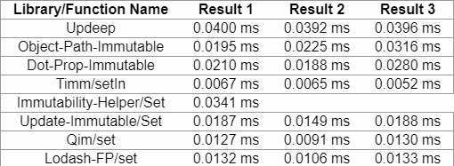

**TL;DR: When you have a nested object on state, and for some reason you cannot normalize it, you can use one of the existing immutable update  utility libraries. I recommend on [timm library](https://github.com/guigrpa/timm).**  

 I am writing this post after getting inspiration from [Dalmais's article](https://hackernoon.com/a-small-trick-to-write-clean-reducers-a0b1b1eff3d2)

### The Problem

*   We have a nested object in our Redux store. For example,
    
    `testObject = { a: { b : { c: { d: 1 } } } }`
    
*   We want to update the value of d from 1 to 2, but we should not mutate the existing object.

### The Naive Solution

*   The regular solution will be to use multiple spreads. The example from [Dalmais's article](https://hackernoon.com/a-small-trick-to-write-clean-reducers-a0b1b1eff3d2) is:  
`gist:maxired/52997a622aa912e8b6c5071697882327`
*   The problem with this approach is that the code is unreadable and pretty ugly.

### Other Solutions

*   Don't use nested objects on store, so you need to do a refactor/normalize it. **This is the best solution**. In most cases, it will be the best choice for the long run, but you might not choose it if, for example, you fix a bug in a legacy code, and refactoring is not a top priority.
*   Use Immutable.JS library: Also an excellent idea, but again, it is not a quick fix.
*   Use Lodash's cloneDeep method. But it is really unnecessary, [as a wise man said](https://twitter.com/dan_abramov/status/688087202312491008).
*   **Use one of the immutable update utility libraries** which enables to set an attribute on a nested object. I will focus on this solution from now on.

### The Requirements:

*   The function should support both objects and arrays in the nested path.
*   The function should support [autovivification](https://en.wikipedia.org/wiki/Autovivification), i.e. it will create objects/arrays along the path when they don't exist.
*   The syntax of the "immutable set" function will be convenient and readable.
*   We should write one sentence only - just invoking the set method and get the desirable result.
*   The function should have a good performance, especially if we use it frequently.
*   The library should have some sort of popularity (4 stars on GitHub is not enough...).
*   The library should be as tiny as possible.

### The Research:

*   The original article pointed on lodash/fp as a possible solution, but as [Mark Erikson commented](https://hackernoon.com/a-small-trick-to-write-clean-reducers-a0b1b1eff3d2) on that article, there are a lot of other possibilities of immutable update utility libraries. A [ big libraries list](https://github.com/markerikson/redux-ecosystem-links/blob/master/immutable-data.md#immutable-update-utilities) appears on his amazing repository.
*   Eventually, I reduced the number of contestants to 8:
    *   [updeep](https://github.com/substantial/updeep)
    *   [object-path-immutable](https://github.com/mariocasciaro/object-path-immutable)
    *   [dot-prop-immutable](https://github.com/debitoor/dot-prop-immutable)
    *   [timm](https://github.com/guigrpa/timm)
    *   [immutability-helper](https://github.com/kolodny/immutability-helper)
    *   [update-immutable](http://github.com/hoytech/update-immutable)
    *   [qim](https://github.com/jdeal/qim)
    *   [lodash/fp](https://github.com/lodash/lodash/wiki/FP-Guide)
*   I wanted to have fun, so I wrote on CodeSandbox  a [React application which compares the performance of all the checked libraries](https://codesandbox.io/s/6vokz6j8wn).
*   There are two main components:
    *   ResultsTable: The main component which renders a table with all of the wanted results.
    *   ResultDisplayer: Component which gets a function and arguments to a function, invoke it constant number of times and renders the average amount of time that the execution of the function took.
*   Every library was tested against three tests with the same test object:                                                                           `{ aObject: { bArray: [{ cObject: { dAttribute: 1 } }] } }`
    *   Test 1: Update aObject.bArray\[0\].cObject.dAttribute from 1 to 2
    *   Test 2: Change aObject.bArray\[1\].cObject.dAttribute(path that doesn't really exist) to 2
    *   Test 3: Change aObject.bArray\[0\].cObject.eAttribute(path that doesn't really exist) to 2
*   Yes, I know... This is not scientific research, and the results are not accurate. But it did gave me a sense of security when I ran the tests over and over, and the first place was always on top.

Comments Before Results:

*   I wanted to test also functions from Ramda, but I didn't find functions that exactly fit. set and evolve functions are closed but close is not enough.
*   immutability-helper library is the [recommended library by React team](https://facebook.github.io/react/docs/update.html), but surprisingly it doesn't support autovivification, so I could execute only the first test on this library.
*   I don't expect anyone to install Lodash only for this need, but if you already use Lodash, it can be a good choice for you.

### The Results:

  
 [Timm/setIn](https://github.com/guigrpa/timm) won in most departments:

*   Like all other contestants, it supports both objects and arrays in the nested path.
*   Like most of the other contestants, it supports autovivification.
*   Its syntax is nice:  For example:  `setIn(TEST_OBJECT, ["aObject", "bArray", 0, "cObject", "dAttribute"], 2)`
*   The operation is done during one sentence, as all other libraries.
*   Its performance is the best by far than most of the other libraries.
*   The library is not so popular - only 163 stars on GitHub when writing this sentence.
*   The library is tiny: about 1.5 kB minified & compressed.

### Last Words

I enjoyed a lot during making this post. It was my first usage of CodeSandbox and it was really cool to write there. Special thanks Maxence Dalmais, which his post encouraged me to do my own research.  I believe that Timm/SetIn is a great option when you need to update a nested object and you cannot refactor your code for some reason.

*This post was originally published on [Links4Developers](https://links4developers.wordpress.com/2017/10/16/how-to-overcome-spread-hell-in-reducers-on-minimum-time/)*